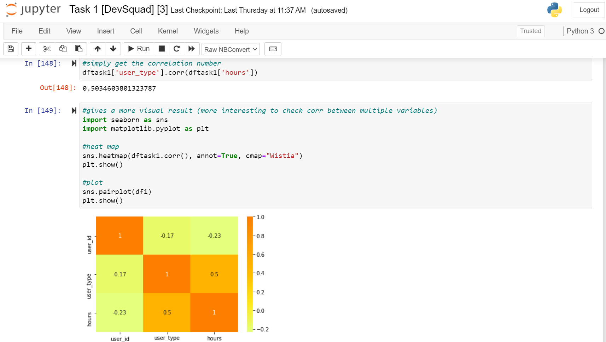

## Devsquad's harvest data analysis

## Description
Harvest is a time tracking and reporting software used by many companies, one of them being Devsquad. In this project a database from Devsquad's harvest account is being analyzed. The project is devided in five main tasks, in which mainly hypothesis are being tested. 

## Data
You can download the databased used in this project here: https://docs.google.com/spreadsheets/d/1VK2ZQyVCNNjh4D-aQ4xyRjU8DrsLhQ9O02FnZ9S_nSU/edit?usp=sharing, although is not necessary.

Obs: in task number 1, one of the dataframes is saved to a csv file used in task number 3. Remember to change the file's path when reading this file on the beginning of task three. Thank you.

## Visuals

## Installation
All we need to have for this project is:

- Pandas (see how to install: https://pt.stackoverflow.com/questions/57487/como-instalar-a-biblioteca-pandas-no-python-3)

- Numpy (see how to install: https://numpy.org/install/)

- Statsmodels (see how to install: https://www.statsmodels.org/stable/install.html)

And a text editing program. I am using Jupyter Notebook, you can learn how to install it in: 

https://docs.jupyter.org/en/latest/install/notebook-classic.html

## Usage
This code is helpfull when it comes to running t-tests and correlations tests on a database to test whether a hypothesis is true or false.

## Tasks Descriptions

# Task 1
Test whether: People that register more hours monthly are the ones that also register time one or more entries with no description or notes.

# Task 2
Create a list classifying projects considering the amount of work done by task names.

# Task 3
Test whether: programmers who created entries and spent more than 3 hours in the same entry are those who have more entries without notes.

# Task 4
Test whether: people who create manual entries have a more even distributed work time during the week, i.e., they work in a regular pace every day, registering the same average amount of hours per day.

# Task 5
Create and test three hypothesis:
    1) People who spend more hours working are the same that enter more programming tasks. 
    2) People work more hours when the client's currency is USD.
    3) People work less hours in december.

## Tasks Results

# Task 1
The null hypothesis, people who registered one or more entries "without any notes" registered just as much hours than the rest, got rejected after receiving a p-value of 3.9371271521266196e-11 after a t-test. Also, if the correlation of 0.5034603801323787 is analyzed, it can be concluded that there are a positive moderated relation between entering more hours and not entering notes.

# Task 2
The most time demanding tasks are those in the Development group, a total of 24669.37 hours registered. Quality Assurance is the second (5926.63 hours) and, actually with a really close number (5177.65) is the DevOps group. After that it comes UI/UX Design, Management, Marketing, Prod Work, Recruitment and Self improving.

# Task 3
After descovering that not even 10% of those who entered at least one time "without any notes" are NOT in the list of those who created entries "bigger than 3 hours", it can stated that programmers who create time entries longer than three hours are probably the same who don't write notes.

# Task 4
Running a correlation test between a "hours only from users who create manual entries" dataframe and a "hours from all the users" dataframe, it can be found that probably, users who create manual entries have NOT a more even work pace during the week, since the number gotten is really close to zero, only -0.05853687472846683. If a t-test is also ran, the null hypothesis that people who create manual entries have a more even work pace during the week can be rejected, since the p-value is also really small: 3.5107658841576125e-08.

# Task 5
    1) People who spend more hours working are the same that enter more programming tasks.
H0: People who spend a higher number of hours than the mean working are the same that enter programming tasks.
Null hypothesis accepted for a p-value of 0.1791899767959702.

    2) People work more hours when the client's currency is USD.
H0: People spend more hours than the mean on projects which the clients currency is GBP.
Null hypothesis rejected for a p-value of 0.030391437008328866.

    3) People work less hours in december.
H0: People work less hours than the mean of the rest of the year in december.
Null hypothesis rejected for a p-value of 7.525432670171487e-07 and correlation of 0.022521589871756283
.
